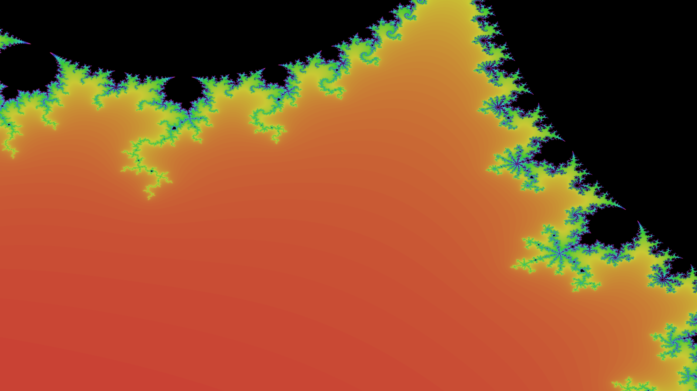

# Mandelbrot visualizer

A visualizer of the [Mandelbrot Set](https://en.wikipedia.org/wiki/Mandelbrot_set).



## Usage

```
> make all
> ./mandel
```

## Dependencies

- [SDL2](https://www.libsdl.org/) - window and OpenGL context
- [glew](http://glew.sourceforge.net/) - OpenGL implementation
